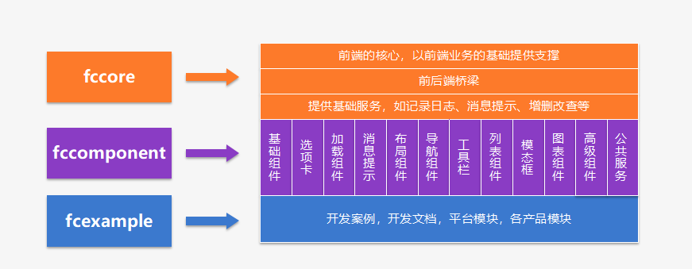
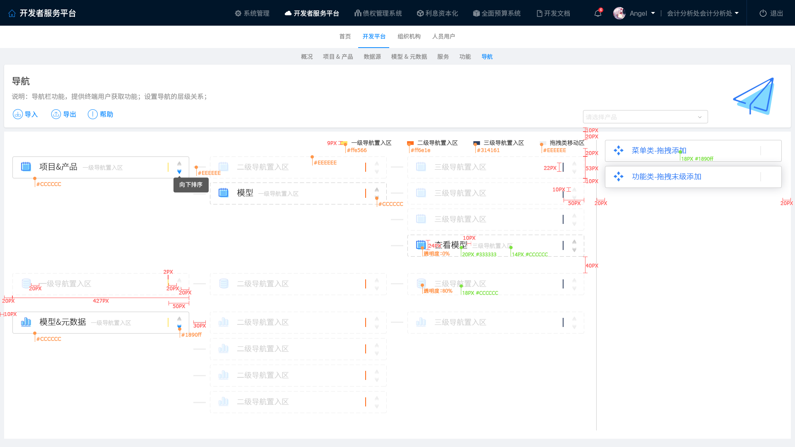

# Fcomponent2组件


- fccomponent2.0是基于蚂蚁金服的Ant Design 1.4版本（跟随ant design升级）作为原始组件，采用angular6的技术框架，结合fccore2.0提供的基础功能，按照各种常用的场景封装的一套组件的产品。它包含基础输入，展示型、选项卡、加载条、提示消息、导航、工具栏、阻断式模态框、列表、图表、高级组件等12大分类75个组件，及抽象父类组成；此组件库产品主要是为日常开发过程中常用的场景提供一整套的组件，便于各产品线编码统一风格，统一思想，统一体系；也为各项目产品提供持续性平滑升级；核心思路:提供两套绑定思路，实现数据与组件的绑定，一种是绑定模型（也称元数据）组件内部完成数据的请求和响应，另外一种是数据由开发人员手动编码的方式从后端获取，通过属性绑定的方式写入到组件内部。



> ## 版本

- 2018-09-13 

```javascript 
npm i fccomponent@2.0.3
```
    // "ag-grid": "^18.1.2",
    // "ag-grid-angular": "^18.1.0",
    // "ag-grid-enterprise": "^18.1.1",
> ## 平台组件示例

```html
<!-- 按钮组件 -->
<fc-button fcLabel="这是一个按钮" fcType="primary"></fc-button>
```
> ## fccomponent2组件父类基类

- 组件父类基类。
- 组件父类基类API文档如下
1. grand(祖父类，父级的父级,ParentList、ParentEdit、ParentDetail继承于grand)
2. 列表的ParentList
3. 编辑页面的ParentEdit
4. 详情页面的ParentDetail


> ##  一、grand(祖父类，父级的父级,ParentList、ParentEdit、ParentDetail继承于grand)

```javascript 

import { OnInit } from "@angular/core";
import { Fcapp } from "fccore2/common/classes";
import { Sysapplinks, Sysappfldgroup } from "fccore2/common/beanclass";
export declare abstract class GrandComponent implements OnInit {
    moduleId: string;
    /**路由参数*/
    routerParam: any;
    /**用户信息*/
    userInfo: any;
    /**当前主应用id*/
    appId: string;
    /**当前主应用*/
    mainApp: Fcapp;
    /** 关系*/
    mainLinks: Sysapplinks[];
    /** 字段分组*/
    mainFldGroups: Sysappfldgroup[];
    /**当前主对象获取方式,默认为*/
    getMainObjWay: number;
    /**
     * 当模型及产品id存在时，则初始化相关的内容，包含模型描述，模型对应的属性及事件
     * @param pid 产品id
     * @param aid 模型id
     */
    constructor(pid?: string, aid?: string);
    /**
     * 初始化存在
     */
    abstract _init(): void;
    /**
     * 当界面显示的时候
     *
     */
    ngOnInit(): void;
    /**
     * 自定义事件名称，所有自定义事件的入口
     * @param eventName 事件名称
     * @param param 参数
     */
    abstract event(eventName: string, param: any): void;
    /**
     * 获取路由导航
     * @param exp List：列表；Edit:编辑:Detail：详情
     */
    getRouteUrl(exp: string): string;
    /**
     * 获取路由导航
     * @param exp List：列表；Edit:编辑:Detail：详情
     */
    getUrl(moduleId: string, appId: string, exp: string): string;
    /**
     * 跳转路由值其它页面
     * @param router 路由目录
     * @param param 路由参数
     * @returns 返回promise
     */
    navigate(url: string, param?: any): Promise<any>;
    /**
     * 获取确认弹窗，需要传点ok后的回调函数及点取消后的回调函数
     * @param content
     * @param ok 确认方法
     * @param cancel 取消的方法
     */
    confirm(content: string, ok: Function, cancel: Function): void;
    /**
     * 阻止冒泡
     */
    stopPropagation(event: any): void;
}
/**
 * 修改对象的获取策略，默认为cache方式获取数据，async为从远程获取数据方式
 */
export declare enum GetMainObjWay {
    'cache' = 0,
    'async' = 1
}


```

> ##  二、列表的ParentList

```javascript

import { Sysappfields, Sysappbuttons } from "fccore2/common/beanclass";
import { GrandComponent } from "./grand.component";
import { FCEVENT } from "./fc";
import { FclistdataComponent } from "./fclist/fclistdata.component";
export declare abstract class ParentlistComponent extends GrandComponent {
    enableAutoSearch: boolean;
    pageList: any[];
    /** 修改对象集合，在列表批量修改时有效*/
    modifyObjs: any[];
    /**条件内容,字符串，必须符合json格式的字符串，当此字符串的值发生变化的时候，自动刷新列表。*/
    condition: string;
    /**查询条件对象内容，所有的查询条件绑定在此对象中。*/
    searchObj: any;
    /** 在列表中选中记录，是单个对象*/
    selectedObject: any;
    /** 选中的所有记录列，是集合对象*/
    selectedObjects: any[];
    /**默认的排序字段*/
    orderBy: string;
    /**分页总数*/
    pageTotal: number;
    /**分页索引*/
    pageNum: number;
    /**分页大小*/
    pageSize: number;
    /**列表字段集合*/
    mainFields: Sysappfields[];
    /**工具栏*/
    mainToolbar: Sysappbuttons[];
    /**列表操作按钮*/
    mainListButtons: Sysappbuttons[];
    /**子列表组件*/
    listWnd: FclistdataComponent;
    /**
     * 根据模型及产品id初始化父类,当此类不具有mid，和模型id的时候，可以不传
     * @param pid 产品id
     * @param aid 模型id
     */
    constructor(pid?: string, aid?: string);
    /**
     * 初始化条件
     */
    private _initCondition;
    /**
     * 初始化当前对象内容
     */
    _init(): void;
    ngOnInit(): void;
    /**
     * 子类初始化
     */
    abstract init(): void;
    /**
     * 子类默认调用对象
     */
    private query;
    /**
    * 获取默认的查询条件
    */
    abstract getDefaultQuery(): any;
    /**
     * 查询重置
     **/
    reset(): void;
    /**
     * 获取查询条件内容
     * @param event
     */
    search(event?: FCEVENT): any;
    /**
     * 分页事件 事件名称，param
     * @param event {eventName:,param:}
     */
    pageQuery(event: FCEVENT): void;
    /**
     * 删除之前的操作
     * @param mainObj
     */
    beforeDelete(mainObj: any): boolean;
    /**
     * 删除之后的操作
     */
    afterDelete(): void;
    /**
     * 列表新增
     * @param event
     */
    listAdd(event?: FCEVENT): void;
    /**
     * 列表编辑
     * @param event
     */
    listEdit(event: FCEVENT): void;
    /**
     * 列表编辑
     * @param event
     */
    listOneEdit(event: FCEVENT): void;
    /**
     * 编辑之前的操作
     */
    beforeEdit(): boolean;
    /**
     * 删除一条记录
     * @param context
     */
    listOneDelete(context: any): void;
    /**
     * 列表批量删除
     * @param event
     */
    listDelete(event: FCEVENT): void;
    /**
     * 列表帮助
     * @param action
     */
    listHelp(action: string): void;
    /**
     * 列表导入
     * @param action
     */
    import(action: string): void;
    /**
     * 列表导出
     * @param action
     */
    export(action: string): void;
    /**
     * 列表工具栏处理事件
     * @param event 事件名称
     */
    tlblistEvent(event: FCEVENT): void;
    /**
     * 查询事件处理
     * @param event 查询事件参数
     */
    searchlistEvent(event: FCEVENT): void;
    /**
     * 自定义事件名称
     * @param eventName 事件名称
     * @param context 上下午环境
     */
    abstract event(eventName: string, context: any): void;
    /**
     * 跳转至新增页面
     * @param params 路由参数
     */
    navigateAdd(params?: any): void;
    /**
     * 跳转至修改页面
     * @param event 当前事件句柄
     * @return promise
     */
    navigateModify(event: FCEVENT): Promise<any>;
    /**
     * 跳转至详情页面
     * @param event 当前事件句柄
     * @return promise
     */
    navigateDetail(event: FCEVENT): Promise<any>;
    /**
     * 单元格选中
     * @param event
     */
    cellClick(event: FCEVENT): void;
    /**
    * 根据列表处理事件
    * @param action 事件名称
    */
    listdataEvent(event: FCEVENT): void;
    /**
     * 选中的数据对象及反选
     * @param event
     */
    onSelect(event: FCEVENT): void;
    /**
     * 在列表中编辑数据对象放入编辑对象中
     * @param event
     */
    onModify(event: FCEVENT): void;
    /**
     * 点赞
     * @param event
     */
    thumbUp(event: any): void;
    /**
     * 下载
     * @param event
     */
    download(event: any): void;
    /**
     * 评论
     * @param event
     */
    evaluate(event: any): void;
    /**
     * 统计
     * @param event
     */
    count(event: any): void;
}


```

> ##  三、编辑页面的ParentEdit

```javascript

import { FCEVENT } from "./fc";
import { GrandComponent } from "./grand.component";
import { Sysappfields } from "fccore2/common/beanclass";
export declare abstract class ParentEditComponent extends GrandComponent {
    /**默认选中的索引*/
    selectedIndex: number;
    /**是否有上一条*/
    hasNext: boolean;
    /**是否有下一条*/
    hasPrev: boolean;
    /**缓存对象内容，主要是在上一条下一条使用*/
    mainObjs: any[];
    /**当前主对象获取方式*/
    getMainObjWay: number;
    /**表单字段列表*/
    mainFields: Sysappfields[];
    /**当前主对象*/
    mainObj: any;
    /**当前对象状态*/
    objStatus: number;
    /** 页面配置的所有校验字段的对象*/
    mainValid: any;
    /**
     * 根据产品id和模型id
     * @param pid 产品id
     * @param aid 模型id
     *
     */
    constructor(pid?: string, aid?: string);
    /**
     * 初始化当前对象内容,
     */
    _init(): void;
    /**
     * 初始化校验规则
     */
    initValid(): void;
    /**
     * 子类初始化
     */
    abstract init(): void;
    /**
     * 子类初始化对象
     */
    abstract addNew(mainObj: any): boolean;
    /**
     * 保存之前的操作
     */
    beforeSave(): boolean;
    /**
     * 保存之后的操作
     */
    afterSave(): void;
    /**
     * 校验是否存在上一条下一条
     */
    checkHasOne(): void;
    /**
     * 上一条
     * @param action
     */
    prev(): void;
    /**
      * 下一条
      * @param action
      */
    next(): void;
    /**
     * 保存新建
     * @param action
     */
    saveNew(action: string): void;
    /**
     * 保存复制
     * @param action
     */
    cardSaveCopy(action: string): void;
    /**
    * 保存
    * @param action 事件名称
    */
    cardSave(action: string): void;
    /**
     * 保存返回
     * @param action 事件名称
     */
    cardSaveBack(action: string): void;
    /**
     * 表单返回
     * @param action 事件名称
     */
    cardBack(action: string): void;
    /**
     * 表单工具栏事件
     * @param event 事件
     */
    tlbformEvent(event: FCEVENT): void;
    /**
     * 验证
     */
    validator(): boolean;
    /**
     * 根据列表处理事件
     * @param action 事件名称
     */
    adformEvent(event: FCEVENT): void;
    /**
     * 保存返回到列表
     * @param eventName
     */
    carSaveBack(eventName: string): void;
    /**
     * 跳转至新增页面
     */
    navigateAdd(): void;
    /**
     * 跳转至详情页面
     */
    navigateDetail(): void;
    /**
    * 跳转至列表页面
    * @param refresh 是否重新
    */
    navigateList(refresh?: boolean): void;
}


```
> ##  四、详情页面的ParentDetail

```javascript
import { FCEVENT } from "./fc";
import { GrandComponent } from "./grand.component";
import { Sysappfields, Sysappbuttons } from "fccore2/common/beanclass";
export declare abstract class ParentDetailComponent extends GrandComponent {
    /**默认选中的索引*/
    selectedIndex: number;
    /**是否有上一条*/
    hasNext: boolean;
    /**是否有下一条*/
    hasPrev: boolean;
    /**缓存对象内容，主要是在上一条下一条使用*/
    mainObjs: any[];
    /**当前主对象*/
    mainObj: any;
    /**表单字段列表*/
    mainFields: Sysappfields[];
    /**表单工具栏按钮*/
    mainButtons: Sysappbuttons[];
    /**当前对象状态*/
    objStatus: number;
    /**
     * 根据产品id和功能id初始化相关的内容
     * @param pid 产品id
     * @param aid 模型id
     */
    constructor(pid?: string, aid?: string);
    /**
     * 子类初始化
     */
    abstract init(): void;
    /**
     * 初始化当前对象内容,包含初始化校验上一条下一条，当前明细对象
     */
    _init(): void;
    /**
     * 校验是否存在上一条下一条
     */
    checkHasOne(): void;
    /**
     * 上一条 
     *
     */
    prev(): void; 
    /**
     * 下一条
     * 
     */
    next(): void; 
    /**
     * 表单返回
     * @param action 事件名称
     */
    cardBack(action: string): void;
    /**
     * 表单工具栏事件
     * @param event 事件
     */
    tlbformEvent(event: FCEVENT): void;
    /**
     * 根据列表处理事件
     * @param action 事件名称
     */
    adformEvent(event: FCEVENT): void;
    /**
     * 跳转至新增页面
     */
    navigateAdd(): void;
    /**
     * 跳转至详情页面
     */
    navigateEdit(): void;
    /**
     * 跳转至列表页面
     * @param reflesh
     */
    navigateList(refresh?: boolean): void;
}

```

